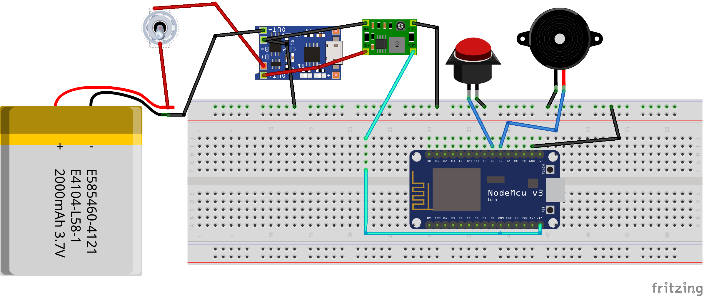

<p align="center">
  <a href="" rel="noopener">
 </a>
</p>

<h3 align="center">Smart Buzzer</h3>

<div align="center">

[]()
[](https://github.com/kylelobo/The-Documentation-Compendium/issues)
[](https://github.com/kylelobo/The-Documentation-Compendium/pulls)
[](/LICENSE)

</div>
---

<p align="center"> Smart Buzzzer
    <br> 
</p>

## Table of Contents

- [About](#about)
- [Getting Started](#getting_started)
- [Usage](#usage)
- [WebApp Links](#webapp)
- [Circuit Diagram](#circuit)
- [Tests](#tests)
- [Built Using](#built_using)
<!-- - [Demo Videos](#videos) -->

## About <a name = "about"></a>

This repository contains ...

## 🏁 Getting Started <a name = "getting_started"></a>

These instructions will get you a copy of the project up and running on you raspberry pi and uploading the firmware on NodeMCU.

### 🔧 Prerequisites

#### NodeMCU

Download the Arduino IDE from here
  - https://www.arduino.cc/en/software

To install the ESP8266 board, (using Arduino 1.6.4+):
  - Add the following 3rd party board manager under "File -> Preferences -> Additional Boards Manager URLs":
       http://arduino.esp8266.com/stable/package_esp8266com_index.json
  - Open the "Tools -> Board -> Board Manager" and click install for the ESP8266"
  - Select your ESP8266 in "Tools -> Board"
- From Sketch Menu select Include Library->Add .ZIP Library...
- Then select the PubSubClient.zip from libs folder to add it.

#### Raspberry Pi(Skip this; not required yet)
Turn on your Raspberry Pi and execute the following commands

```
- sudo apt update
- sudo apt upgrade
- sudo pip3 install paho-mqtt

```

### 🚀 Installing

#### NodeMCU Firmware

- Double click on Buzzer_Firmware.ino file and it will open the firmware.
- Add your WiFi credentials by modifying the lines 26 and 27 in Buzzer_Firmware.ino. Change WiFi Name to your WiFi hotspot name and password to the WiFi password.

``` 
const char* ssid = "WiFi Name";
const char* password = "WiFi Password";

```
- From Tools Menu select Baord->ESP8266 Boards->NodeMCU 1.0 (ESP-12E Module)
- From Tools Menu select Port and select the available port
- From Sketch Menu click on Upload to upload the code


#### Raspberry Pi

Conifguring NodeRED, MQTT and Firmware(required only one time)
- Copy Fimrware folder to the Desktop of Raspberry Pi

Open the terminal and execute the following commands

```
- sudo apt update
- sudo apt upgrade
- cd ~/Desktop/Firmware/
- sudo chmod a+rx starter.sh
- sudo apt install ufw
- sudo ufw enable
- sudo ufw allow tcp http https 1883 8883 1880
```
##### Installing MQTT(Mosquitto)
Open the terminal and execute the following commands

```
- sudo apt install -y mosquitto mosquitto-clients
- sudo systemctl enable mosquitto.service
- mosquitto -v
```
##### Installing and Configuring NodeRED
Open the terminal and execute the following commands

```
- bash <(curl -sL https://raw.githubusercontent.com/node-red/linux-installers/master/deb/update-nodejs-and-nodered)
- sudo systemctl enable nodered.service
- npm install node-red-dashboard 
- sudo npm install node-red-dashboard
- sudo systemctl restart nodered.service
```
Then open NodeRED in your raspberry pi or using any other device which is connected to the same network
as your Raspberry Pi is.
In the browser you can type http://raspberrypi.local:1880 to open the node-red

- Once node-red is opened, click on the menu button on the top left corner of the app and click on import.
- Click on `select file to import` and select flows.json present in the Flows directory of this repo.
- After flows are imported, click on Deploy button on the top of the screen to save the changes.
- You can access the Dashboard using http://raspberrypi.local:1880/ui


## Usage <a name = "usage"></a>

#### Raspberry Pi

- Just turn on the raspberry pi and navigate to the dashboard URL using any device


## WebApp Links <a name = "webapp"></a>


- Dashboard http://raspberrypi.local:1880/ui

## Circuit Diagram <a name = "circuit"></a>
Connect the Buzzer, Push Button, Battery, Charging Module, StepUp converter as shown in the picture below.



## Test <a name = "tests"></a>

- Install MQTTLens which is a chrome extension from the link below
- https://chrome.google.com/webstore/detail/mqttlens/hemojaaeigabkbcookmlgmdigohjobjm?hl=en
- Now open MQTTLens, click on '+' button next to 'Connections' on top left corner
- In connection name add 'HiveMQ', in hostname add 'broker.hivemq.com' and then scroll down and click 'CREATE CONNECTION'   button
- Now in Subscribe section put 'smartbuzzer/b' and click 'SUBSCRIBE' button next to it.
- Restart your NodeMCU by pressing RST button on your nodemcu
- once done, you will see data comming from NodeMCU to MQTTLens and when you press the buzzer button, you will see the MQTTLens log will show 'Pressed_some unique number'

## ⛏️ Built Using <a name = "built_using"></a>

- [Python](https://www.python.org/) - Programming Language
- [Arduino](https://www.arduino.cc) - Arduino IDE
- [NodeRED](https://nodered.org/) - NodeRED

## Demo Videos <a name = "videos"></a>

- System Demo video: https://youtu.be/qseJCq_fw7s